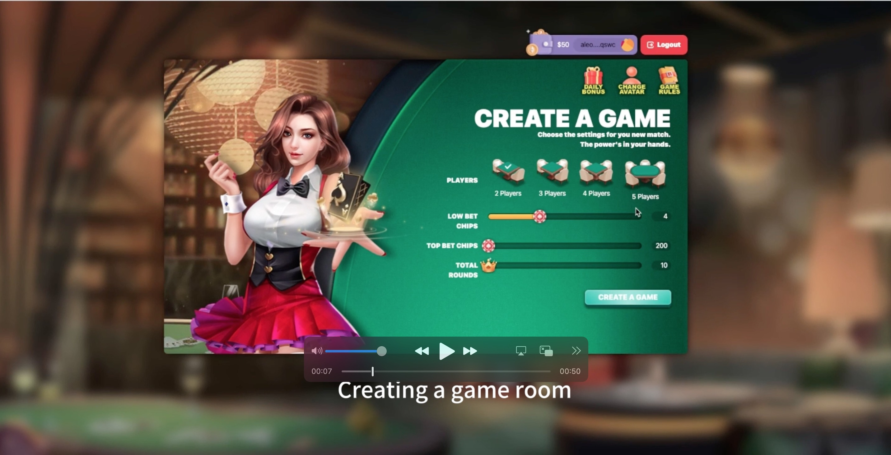
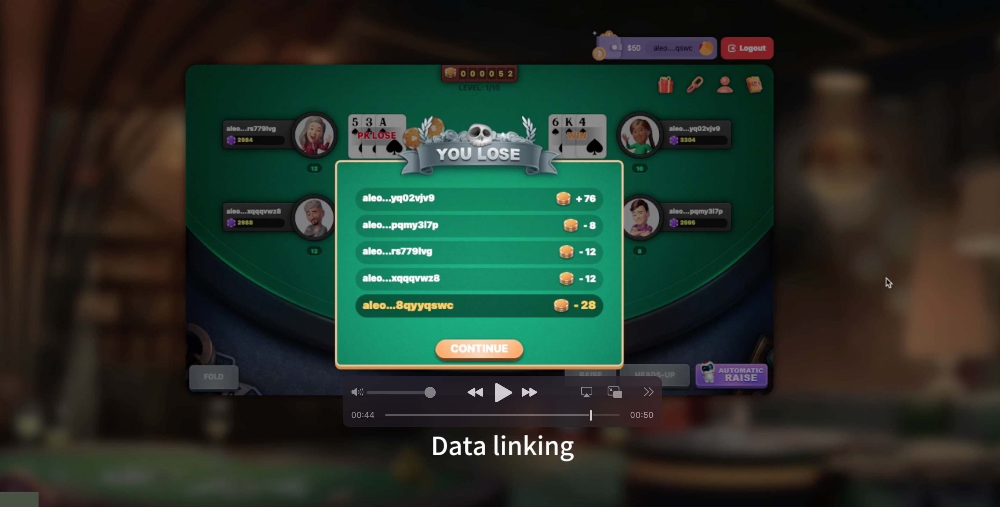

# Introduce
"3Card Poker" is Web3 DApp Game that utilizes ZKP for transactions, with asset records stored on an immutable blockchain.
# Strategy
"3Card Poker" are relatively simple and require at least two people to participate. The game uses a deck of playing cards with the size of the king removed. It is usually played by three or four people. Each person can get three cards, and the person with the largest face wins.
,roughly divided into the following types:

### Card is composed of two attributes: 
```bash
record Poker {
  Value u32
  Color u32
}
```
| Attributes |                                                                          |
|------------|------------------------------------------------------------------------------------|
| Value      | 2->2; 3->3; 4->4; 5->5; 6->6; 7->7; 8->8; 9->9; 10->10; 11->J; 12->Q; 13->K; 14->A;|
| Color      | 4->Spades; 3->Hearts; 2->Clubs; 1->Diamonds;                                       |

### 6 types of card combinations, ranked from highest to lowest:

| Length | Bitstring | u64 |
| --- | --------- | --- |
| Three of a Kind | AAA | 222|
| Straight Flush | AKQ  | A23|
| Flush | AKQ   | A23 |
| Straight | AKQ   | A23 |
| Pair | AAK   | 223 |
| High Card | AKJ   | 352 |

In "3Card Poker" game, the leopard is the largest card type, followed by Shun Jin, Golden Flower, Shun Zi, Pair, Scattered cards. Compare face sizes when two or more of the same card type appear.

# Rules 
  After the game begins, the player to the left of the dealer begins to bid. There are three ways to bid: see, compare and fold. Looking at the card means that the player can choose to continue playing after seeing his own card. Comparing the card means that the player can compare the size of the card face with other players to see whose card face is larger. Abandoning the card means giving up the current round of the game. If only one person sees the card, then he is the winner; if more than one person sees the card, then the person with the largest face is the winner; if everyone abandons the card, then the last person to see the card is the winner.

## 1、Create Game, Share a link Invite a friend to play


## 2、Game Playing, interactive betting、making comparisons


## 3、Game Over


## Build Guide

To compile this Aleo program, run:
```bash

## contracts publish
cd contracts/game_3_card_poker
leo run
snarkos developer deploy "game_3_card_poker.aleo" --private-key "" --query "https://vm.aleo.org/api" --path "./build/" --broadcast "https://vm.aleo.org/api/testnet3/transaction/broadcast" --fee 1000 --record ""


## ui build
cd web
npm install 
npm run build
docker compose up -d

## server build
cd server
docker compose up -d
```